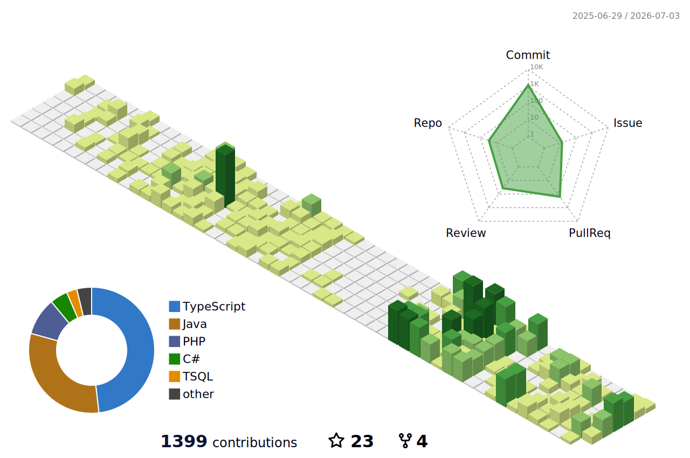

  

<h1 align="center"> Hello, I'm v.</h1>
<h3 align="center"> Software Engineer | Tech Explorer | Open for Collaboration</h3>

  

  

  

---

  
  
  
  
  
  
  

  

---

  

---

<!-- 

  

 -->

<!-- 

 -->

<table>
  <tr>
    <td>
      
    </td>
    <td>
      
    </td>
  </tr>
  <tr>
    <td>
      
    </td>
    <td>
      
    </td>
  </tr>
  <!-- <tr>
    <td colspan="2" align="center">
      
    </td>
  </tr> -->
</table>

---

- 🔭 Currently working on **C#(.NET), PHP, Java, and Client-based Systems (Private Projects)**
- 🌱 Deepening my knowledge in **C#, PHP, Python, API, DevOps, Cyber Security and AI Tools**
- 👯 Open to building **Custom Systems for personal and small businesses**
- 🤝 Looking to **collaborate with fellow developers** on meaningful projects
- 👨‍💻 Explore my work: [My Portfolio](https://0xvnft.github.io/)
- 📝 Active contributor on [Stack Overflow](https://stackoverflow.com/users/12280406/solitude)
- 💬 Ask me about **Java**, **JavaScript**, **Typescript**, and **Web Development (API)**
- 📫 Reach me at **0xvNFT@gmail.com**
- 📄 Check my profile here: [Solitude](https://stackoverflow.com/users/12280406/solitude)
- 🔖 Previous GitHub profile: [Jeiseun1017](https://github.com/jeiseun1017)
- ⚡ Fun fact: *Reserved by nature, but I never fail to crack a good joke when it counts.*

---

  
  
  
  
  
  

---

  
  
  
  

   
   
   
  

---

  

---

  

---

<table align="center" border="0" cellspacing="0" cellpadding="10"><tr>
  <td align="center">
    
  </td>
  <td align="center">
    
  </td>
</tr></table>

<table align="center" border="0" cellspacing="0" cellpadding="8"><tr>
  <td align="center"></td>
  <td align="center"></td>
  <td align="center"></td>
  <td align="center"></td>
  <td align="center"></td>
  <td align="center"></td>
  <td align="center"></td>
  <td align="center"></td>
  <td align="center"></td>
  <td align="center"></td>
  <td align="center"></td>
  <td align="center"></td>
</tr></table>

  

---

  

  

