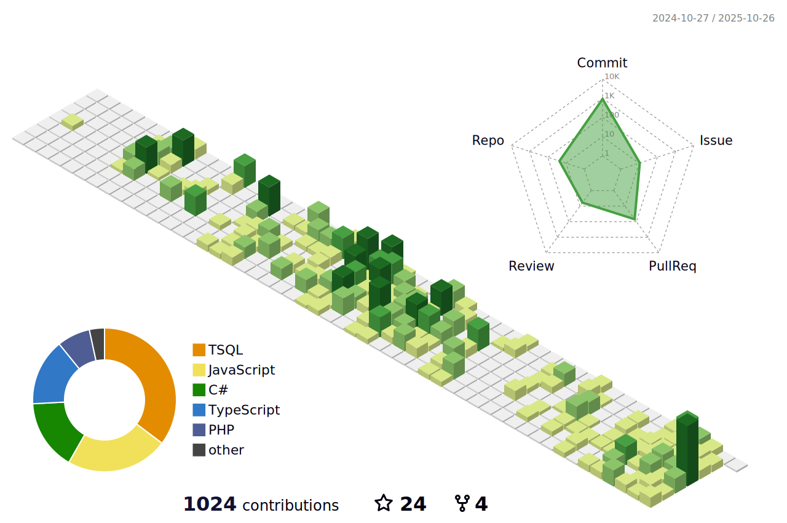

<h1 align="center">👋 Hello, I'm v. </h1> 
<h3 align="center">🚀 Passionate Backend Developer | 💡 Tech Explorer | 🤝 Open to Collaboration</h3> 

  

<!-- GitHub Profile Trophy -->
---

## 🏆 GitHub Trophies

  <a href="https://github.com/ryo-ma/github-profile-trophy">
    <!-- Light mode -->
    
    <!-- Dark mode -->
    
  </a>

---

<!-- Twitter Badge -->

  

---

## 👨‍💻 About Me
- 🔭 Currently working on **C#, PHP, Java, and Client-based Systems (Private Projects)**
- 🌱 Deepening my knowledge in **C#, PHP, Full-Stack Development, and Modern Web Practices**
- 👯 Open to building **custom systems for small businesses**
- 🤝 Looking to **collaborate with fellow developers** on meaningful projects
- 👨‍💻 Explore my work: [My Portfolio](https://0xvnft.github.io/)
- 📝 Active contributor on [Stack Overflow](https://stackoverflow.com/users/12280406/solitude)
- 💬 Ask me about **Java**, **JavaScript**, **Android**, or **Web Development (API)**
- 📫 Reach me at **0xvNFT@gmail.com**
- 📄 Check my profile here: [Solitude](https://stackoverflow.com/users/12280406/solitude)
- 🔖 Previous GitHub profile: [Jeiseun1017](https://github.com/jeiseun1017)
- ⚡ Fun fact: *Reserved by nature, but I never fail to crack a good joke when it counts.*

---

## 🌐 Connect with Me

  
  
  
  
  
  

---

## 🛠️ Languages & Tools

                     
                 

---

## 📊 GitHub Stats

  <!-- Light mode -->
  
  
  

  <!-- Dark mode -->
  
  
  

---

## ☕ Support My Work

  
  

  
  
  
  
  
  
  
  

